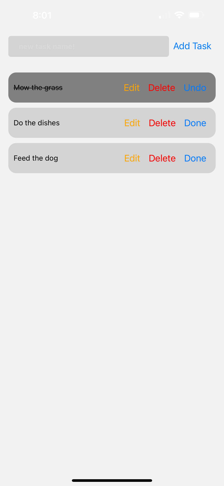

# Project Name

## Requirements
- Add ✅
- edit ✅
- delete ✅
- mark tasks as complete. ✅
- Persist tasks using AsyncStorage. ✅

## Things to Use
Components: FlatList, TextInput, Button.
State management with useReducer.
AsyncStorage for data persistence.

## Acceptance Criteria
Tasks are saved across app reloads.
UI updates correctly after task operations.

## Get started

1. Install dependencies

   ```bash
   npm install
   ```

2. Start the app

   ```bash
    npx expo start
   ```

## Image



## Notes

https://dribbble.com/shots/19752197-Task-Management-App